# Log Aggregator System
[](https://python.org)  
[](https://aws.amazon.com)
[](https://github.com/H1shamM/log-aggregator/actions)
[](https://codecov.io/gh/H1shamM/log-aggregator)
[]()

## About
This project demonstrates an event-driven log pipeline for microservices, ensuring that no log is lost even under failures. It uses durable RabbitMQ queues with a dead-letter exchange, batch uploads to S3, and KEDA-powered autoscaling. Local fallback storage guarantees reliability when S3 is unavailable.

## Features
- 📨 **RabbitMQ** message queue with durable queues and DLQ  
- ⚡ **Parallel batch processing** with ThreadPoolExecutor  
- 🔁 **Automatic retries** and dead-letter queue for failures  
- ☁️ **AWS S3** integration with fallback local storage on credential errors  
- 🚀 **Kubernetes KEDA** autoscaling based on queue length  

```mermaid
flowchart LR
  A[Producer] -->|AMQP| B[RabbitMQ Queue]
  B --> C[Consumer Service]
  C --> D{Batch ≥ BATCH_SIZE?}
  D -- Yes --> E[S3 Upload]
  E --> F[AWS S3]
  D -- No  --> C
  C -->|Fail| G[Local Fallback]
  B -->|Dead-letter| H[DLQ]
  H --> I[Alerting]
```



## Prerequisites
- Docker & Docker Compose  
- Python 3.9+  
- `kubectl` & a local Kubernetes cluster (minikube or Docker Desktop)  
- AWS CLI configured (`aws configure`) for local S3 testing  

## Quickstart

```bash
# Clone & enter
git clone https://github.com/H1shamM/log-aggregator.git
cd log-aggregator

# 1) Bring up RabbitMQ & MinIO (for S3 emulation)
docker-compose up -d

# 2) Local Python env
python3 -m venv .venv && source .venv/bin/activate
pip install -r requirements.txt

# 3) Run services
# in one shell
python src/producer/producer.py
# in another shell
python src/consumer/consumer.py

# 4) Tear down
docker-compose down
```

## Environment Variables
| Variable         | Default                       | Description                            |
|------------------|-------------------------------|----------------------------------------|
| `RABBITMQ_HOST`  | `localhost`                   | RabbitMQ server address                |
| `RABBITMQ_QUEUE` | `log_queue`                   | Primary queue name                     |
| `RABBITMQ_DLQ`   | `log_dlq`                     | Dead-letter queue name                 |
| `S3_BUCKET`      | _none_                        | Your AWS S3 bucket name                |
| `AWS_REGION`     | `us-east-1`                   | AWS region for S3                      |
| `BATCH_SIZE`     | `50`                          | Number of messages per upload batch    |
| `FALLBACK_PATH`  | `/tmp/failed_logs.ndjson`     | Local file for failed logs             |
| `MAX_WORKERS`    | `5`                           | Threads for parallel uploads           |
| `RETRY_LIMIT`    | `3`                           | S3 upload retry attempts               |

## Testing

```bash
# Install dev dependencies
pip install -r requirements-dev.txt

# Run unit tests
pytest --maxfail=1 --disable-warnings -q

# Generate coverage report & enforce threshold
coverage run -m pytest
coverage report --fail-under=85
```

## Kubernetes Deployment

```bash
# Build & push your image
docker build -t yourrepo/log-aggregator:latest .
docker push yourrepo/log-aggregator:latest

# Apply manifests
kubectl apply -f kubernetes/manifests/
```
